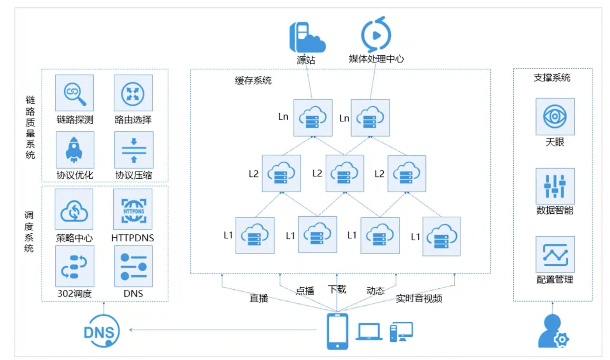
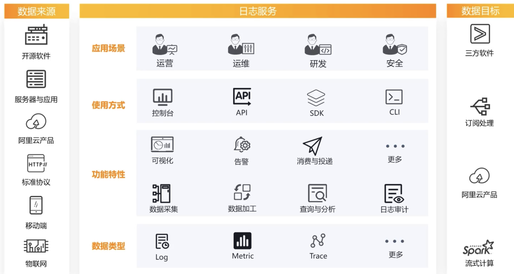

# 云解析
## DNS
域名系统（Domain Name System， DNS）是互联网的一项服务。它作为域名和IP地址相互映射的一个分布式数据库，能够使人更方便地访问互联网。

## 云解析DNS架构
阿里云的DNS解析产品是云解析DNS。
* 加速域名使用的解析服务商可以是阿里云以外的公司。
* 云解析中的智能DNS解析不支持页面内容缓存。
* 智能DNS解析，会判断访问者的来源，为不同的访问者智能返回不同的IP地址。
云解析DNS是由管控层和解析层两部分组成：
* 管控层：通过通知台和OpenAPI对外提供服务，主要实现了域名解析数据、配置数据、日志数据等增删改查和存储功能。
* 解析层：主要实现了对域名解析记录数据请求进行应答的功能。

## 企业网站建设流程
* 域名注册认证
* 网站建设备案
* 配置域名解析
* 部署SSL证书
* 网站上线

## 域名解析过程

* 本地域名在浏览器输入example.com，则由**本地服务器开始递归查询**。
* 本地服务器采用**迭代查询**的方法，向根域名服务器进行查询。
* 根域名服务器告诉本地域名服务器，下一步应该查询的顶级域名服务器.com TLD的IP地址。
* 本地域名服务器向顶级域名服务器.com TLD进行查询。
* TLD 服务器告诉本地服务器，下不要查询example.com权威域名服务器的IP地址。
* 本地服务器向example.com权威域名服务器查询。
* example.com权威域名服务器告诉本地服务器所查询的主机IP地址。
* 本地域名服务器最后把IP地址响应给浏览器。

## 云解析支持的记录
* A记录：添加A记录可以实现将域名指向IPv4地址。
* AAAA记录：当预期是实现访问者通过IPv6地址访问网站，可以使用这个记录。
* CNAME记录： 当需要将域名指向另一个域名，再由另一个域名提供IP地址，就需要添加CNAME记录。常用场景包括：CDN、企业邮箱、全局流量管理等。
* PTR记录：反向解析指的是IP地址映射到域名上。
* SRV记录：SRV记录用来标识某台服务器使用了某个服务，常见于蔚然系统的目录管理。
## 使用注意事项
### 开启注册局安全锁
开启安全锁后，域名将被置为以下三中状态：
* 注册局设置禁止删除（serverDeleteProhibited）。
* 注册局设置禁止转移（serverTransferProhibited）。
* 注册局设置禁止更新（serverUpdateprohibited）。
## 域名赎回
* 域名进入赎回期，用户需要比正常续费价格高的费用来赎回域名。
* 赎回期域名解析会被暂停，成功赎回后，通常要24～48小时才能恢复解析服务。
* 阿里云账号下的国际域名错过了赎回期，会进入**五天**的等待删除期。
* 在急需赎回域名页面下如果找不到域名，可能是超过赎回期被注册局删除。

## TTL
TTL：Time-To-Live，生存时间。TTL值指的是全国各地的LocalDNS服务器中缓存解析结果的时间周期。

LocalDNS会将查询到的解析结果，保存到本地一段时间。保存时间周期，就是根据TTL设置而来的。

当权威DNS异常时，DNS Cache在缓存期内可以继续提供服务，缩短故障时间。
# CDN
## CDN的概念
长距离传输、不同运营商互联互通等原因导致网拥堵。

CDN通俗理解就是网站加速，可以解决跨运营商，跨地区，服务器负载能力过低，带宽过少等导致的网络响应速度慢的问题。
* 建立并覆盖在承载网之上。
* 由遍布全球的边缘节点服务器群组成。
* 分担源站压力，避免网络拥堵。
* 解决跨地域运营商网络性能问题。
* 提供稳定快速的加速服务。
* 面向开发者的生态可自定义加速逻辑。

关键组件有**LVS、Tengine**以及**Swift**：
* LVS做四层均衡负载。
* Tengine做七层均衡负载。
* Swift做HTTP缓存满足缓存需求。
## 产品优势
* 丰富资源节点
* 资源可弹性扩展
* 精准的调度系统
* 智能的传输链路
* 高速的缓存策略
* 降低IT成本
* 强大的宽带输出能力
* 提供行业通用标准API

五大竞争力：

* 产品竞争力 
* 技术竞争力
* 价格竞争力
* 生态竞争力
* 服务竞争力

阿里云内容分发网络CDN与传统厂商的CDN相比具有**稳定快速**、**节约成本**和**简单易**用三个特点。
* 节约成本：
    * 资源弹性扩展，按实际只用量付费，接入即可实验跨运营商、跨地域的全网覆盖。
    * 先使用后付费，提供按流量或者峰值宽带两种计费方式；
    * 对于网站突发流量，无需用户干预，自动作出响应和调整，有效减少源站压力。
    * 同一地域内的CDN和云服务ECS实例之间，通过内网访问时不收回源流量费。
    * 通过内容分发网络CDN来减少服务器的带宽输出，降低带宽费用。

## CDN架构

由调度系统、链路质量系统、缓存系统和支持系统这四大系统组成：
* 调度系统：处理用户解析请求。
* 链路质量系统：监测实时负载及健状况。
* 缓存系统：缓存用户请求的资源。
* 支撑服务系统：监测资源、分析数据、管理配置。
## 应用场景

静态资源：多次请求某一资源，响应内容是相同的

动态资源：多次请求某一资源，响应返回的数据可能是不同的内容。
* 图片小文件：适用于网站或者应用中小文件的加速分发，如门户网站、电子商务类网站、新闻资讯、娱乐游戏网站。
* 大文件下载：适用于各种大文件的下载和分发加速。如按专包、应用更新。
* 视音频点播
* 兼顾安全和动静态混合内容加速：全站加速是阿里云自主研发的融合了动态加速、静态加速和安全保护能力的CDN产品。

**全站加速DCND**支持纯动态加速和动静态混合加速

### CDN和OSS结合使用的产品优势
对象存储OSS与阿里云CDN服务结合，可将OSS内部的文件缓存到CDN边缘节点。当大量用户重复访问同一文件时，可以直接从边缘节点获取已缓存的数据，提高访问的响应速度。

## CDN操作配置
1.  **开通CDN服务**
2.  **添加加速域名**
    * 配置基础信息也业务信息
    * 配置源站
    * 完成域名审核
3. 推荐配置（可选）
    * 缓存过期时间
    * 宽带封顶
    * 页面优化
4. 模拟访问测试（可选）
5. **配置CNAME**
    * 复制加速域名对应的CNAME记录值
    * 在相应DNS服务器上添加CNAME记录

| 类型 | 定义 | 说明 |
| ---- | ---- | ---- |
| CNAME记录/ CNAME域名 |指域名解析中的别名记录，用来把一个域名解析到另一个域名，再用CNAME域名解析到需要访问的服务器IP地址。如把www.aliyun.com解析到www.aliyun-01.com|成功添加加速域名后，CDN会为用户自动分配一个CNAME域名。你需要在域名解析服务商处将加速域名的DNS解析记录指向CNAME域名，访问请求才能转发到CDN节点上，实现CDN加速|

* 域名解析服务商可以是阿里云以外的公司，如腾讯云。
* 如果您的加速域名提前转移到阿里云，且在一个账号下管理，可以实现一键修改解析。
* 为加速域名分配的CNAME地址只限具体IP地址，有阿里云CDN系统智能控制。
* 加速域名不能与源站域名相同，否则会造成循环解析，无法回源。
* 加速域名使用的DNS系统不一定需要支持智能解析功能。
* 不支持接入的域名：无效游戏、无版权、p2p赌、违规医、黄赌彩票。
### 源站类型
* OSS域名：OSS Bucket外网域名
* IP：支持配置多个外网IP作为源站地址
* 源站域名
* 函数计算域名
## 配置OCSP Stapling
OCSP (Online Certificate Status Protocal)，在线证书协议，可实现由CDN预先缓存在线证书验证结果并下发给客户端，无需浏览器向CA站点查询证书状态，从而减少用户验证时间。
## CDN计费
CDN计费的流量比CDN日志中的记录要多7%-15%，因为**TCP/IP包头的消耗**和**TCP重传**
## 缓存管理
### CDN刷新缓存
* 刷新：强制删除缓存。将分发节点上缓存的资源标记为过期，当用户再次对资源发起请求时，节点会回源拉取资源，并缓存一份更新后的资源在分发节点。
    * URL刷新
    * 目录刷新
    * 正则刷新
* URL预热：源站主动将对应的资源缓存到CDN节点。用户可直接拿到最新的资源无需回源。预热功能会提高缓存命中率。
### CDN缓存命中率低的原因
* 缓存设置不合理。
* CDN控制台设置了不缓存的规则。
* 源站动态内容较多。
* 刷新操作过户频繁。
* 文件热度不够。
* CDN的加速URL中带有可变参数。
* 源站开启多副本缓存。
* 开启了强制Range回源。

## 回源配置
* 源站：决定了回源时请求到那个IP。指用户的业务服务器。
* 回源HOST：决定回源请求访问到该IP上的哪个站点。

### 配置Range回源
* Range回源，指CDN节点在回源HTTP请求里面携带了Range信息，源站在收到CDN节点的回源请求时，根据HTTP请求头中的Range信息返回指定范围的内容数据给CDN节点。
* Range回源可有效提高文件分发效率，可以提高缓存命中率，较少回源流量消耗和源站压力，并且提升西苑响应速度。
### 配置状态码过期时间。
配置状态码过期时间主要适用于源站响应了异常状态码的情况下，用于指定CDN节点上执行缓存处理动作。如果源站无法响应所有的码，且不希望回源，可以配置状态码过期时间，由CDN节点直接响应状态码，减轻源站压力。
## 访问控制
|功能|说明|
|----|----|
|IP黑白名单|配置访问请求来源的IP，来实现访客身份的识别和过滤，限制访问CDN资源的用户，防止恶意IP盗刷、攻击等问题|
|URL鉴权|用户按照指定的签名方式对特定的URL增加鉴权认证，用户可以通过自行配置校验权限URL中的加密串和时间戳，保护用户站点的资源不被非法站点下载盗用。URL鉴权比防盗链安全性更高，适合于安全密级较高的文件。|
|远程鉴权|用户有自己单独的鉴权服务器，由用户自主管理。|
|UA黑白名单|配过配置User-Agent黑白名单来实现对访客身份的识别与过滤。|
|Referer防盗链|配置访问请求来源的域名，即Referer黑名单和白名单，实现身份识别与过滤，禁止其他网站引用您的资源链接。拒绝访问请求返回403。该功能默认不启用。黑名单与白名单互斥，只能选择其一。支持多个Referer名单，回车符分隔。|

## 常见问题
### CDN加速后出现空白页面

# 日志
日志服务（SLS）

# 云监控
## 应用场景
* 天然集成：无需购买和开通。
* 数据可视化：通过Dashboard为用户提供丰富的图标展示。
* 监控数据处理
* 灵活报警：提供监控项报警服务。
* 支持阿里云产品和非阿里云产品的监控，后者需要装插件。

## 基本功能
|功能|说明|
|----|----|
|Dashboard|在一个控制大盘中跨云服务、实例查看监控数据|
|应用分组|支持用户从业务角度集中管理服务器。数据库、负载均衡、存储资源等、从而实际业务需求来管理报警规则，查看监控，提升运维效率。|
|主机监控|主机监控通过在阿里云和非阿里云主机上安装插件，监控主机的CPU、内存、磁盘、网络等控制项，并对所有控制项提供报警功能。|
|自定义监控|根据自己关心的业务指标这是自定义监控，将采集到的监控数据上报至云监控，由云监控进行数据处理，并根据处理结果进行报警。|
|日志监控|提供日志数据实时分析，监控图标可视化展示和报警功能。用户只需要开通日志服务，将本地日志通过日志服务进行收集，即可解决企业的监控运维与运维诉求。|
|站点监控|通过遍布全国的互联网终端节点，发送模拟真实用户访问的探测请求，监控全国各个省市运营商网络的终端用户到服务站点的访问情况。|
|云产品监控|可以查看各个云产品的监控图表，交接资源的运行状况。|
|报警服务|为用户提供监控数据的报警功能。|

## 主机监控
|类型|描述|采集力度|常见项|
|----|----|----|----|
|基础监控项|ECS级别，无需安装插件|1分钟一次|1. CPU使用率 2.  网络流量 3.  磁盘读取BPS、所有磁盘写入BPS  4. 所有磁盘读IOPS、所有磁盘写IOPS|
|操作系统监控项|深入系统内部，需要安装插件|15秒一次|1.  空闲CPU百分比 2. 内存使用率 3. 磁盘使用率 4.  系统平均负载 5. 网卡没秒接受、发送的数据包数|

## 报警联系人/组
* 删除报警联系人
* 删除报警联系组
* 删除报警联系组的报警联系人
    * 只剩一人无法删除
