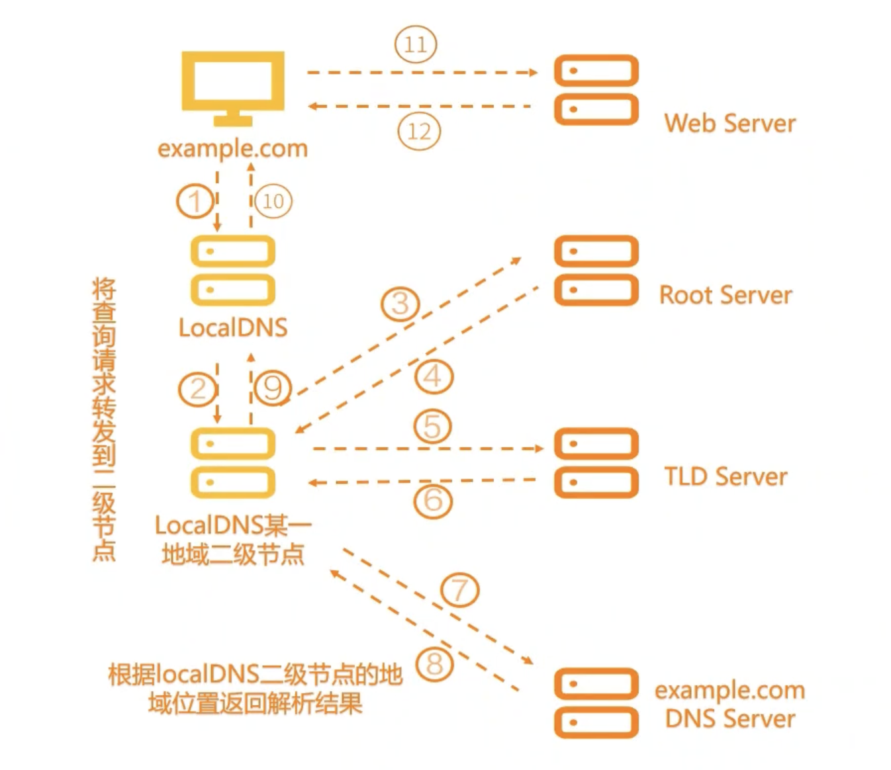

# 云解析
## DNS
域名系统（Domain Name System， DNS）是互联网的一项服务。它作为域名和IP地址相互映射的一个分布式数据库，能够使人更方便地访问互联网。

## 云解析DNS架构
云解析DNS是由管控层和解析层两部分组成：
* 管控层：通过通知台和OpenAPI对外提供服务，主要实现了域名解析数据、配置数据、日志数据等增删改查和存储功能。
* 解析层：主要实现了对域名解析记录数据请求进行应答的功能。

## 企业网站建设流程
* 域名注册认证
* 网站建设备案
* 配置域名解析
* 部署SSL证书
* 网站上线

## 域名解析过程

* 本地域名在浏览器输入example.com，则由**本地服务器开始递归查询**。
* 本地服务器采用**迭代查询**的方法，向根域名服务器进行查询。
* 根域名服务器告诉本地域名服务器，下一步应该查询的顶级域名服务器.com TLD的IP地址。
* 本地域名服务器向顶级域名服务器.com TLD进行查询。
* TLD 服务器告诉本地服务器，下不要查询example.com权威域名服务器的IP地址。
* 本地服务器向example.com权威域名服务器查询。
* example.com权威域名服务器告诉本地服务器所查询的主机IP地址。
* 本地域名服务器最后把IP地址响应给浏览器。

## 云解析支持的记录
* A记录：添加A记录可以实现将域名指向IPv4地址。
* AAAA记录：当预期是实现访问者通过IPv6地址访问网站，可以使用这个记录。
* CNAME记录： 当需要将域名指向另一个域名，再由另一个域名提供IP地址，就需要添加CNAME记录。常用场景包括：CDN、企业邮箱、全局流量管理等。
* PTR记录：反向解析指的是IP地址映射到域名上。
* SRV记录：SRV记录用来标识某台服务器使用了某个服务，常见于蔚然系统的目录管理。
## 使用注意事项
### 开启注册局安全锁
开启安全锁后，域名将被置为以下三中状态：
* 注册局设置禁止删除（serverDeleteProhibited）。
* 注册局设置禁止转移（serverTransferProhibited）。
* 注册局设置禁止更新（serverUpdateprohibited）。
## 域名赎回
* 域名进入赎回期，用户需要比正常续费价格高的费用来赎回域名。
* 赎回期域名解析会被暂停，成功赎回后，通常要24～48小时才能恢复解析服务。
* 阿里云账号下的国际域名错过了赎回期，会进入**五天**的等待删除期。
* 在急需赎回域名页面下如果找不到域名，可能是超过赎回期被注册局删除。

## TTL
TTL：Time-To-Live，生存时间。TTL值指的是全国各地的LocalDNS服务器中缓存解析结果的时间周期。

LocalDNS会将查询到的解析结果，保存到本地一段时间。保存时间周期，就是根据TTL设置而来的。

当权威DNS异常时，DNS Cache在缓存期内可以继续提供服务，缩短故障时间。
# CDN
长距离传输、不同运营商互联互通等原因导致网拥堵。

通俗理解就是网站加速，可以解决跨运营商，跨地区，服务器负载能力过低，带宽过少等导致的网络响应速度慢的问题。
## 产品优势
* 丰富资源节点
* 资源可弹性扩展
* 精准的调度系统
* 智能的传输链路
* 高速的缓存策略
* 降低IT成本
* 强大的宽带输出能力
* 提供行业通用标准API

五大竞争力：

* 产品竞争力 
* 技术竞争力
* 价格竞争力
* 生态竞争力
* 服务竞争力

阿里云内容分发网络CDN与传统厂商的CDN相比具有**稳定快速**、**节约成本**和**简单易**用三个特点。
