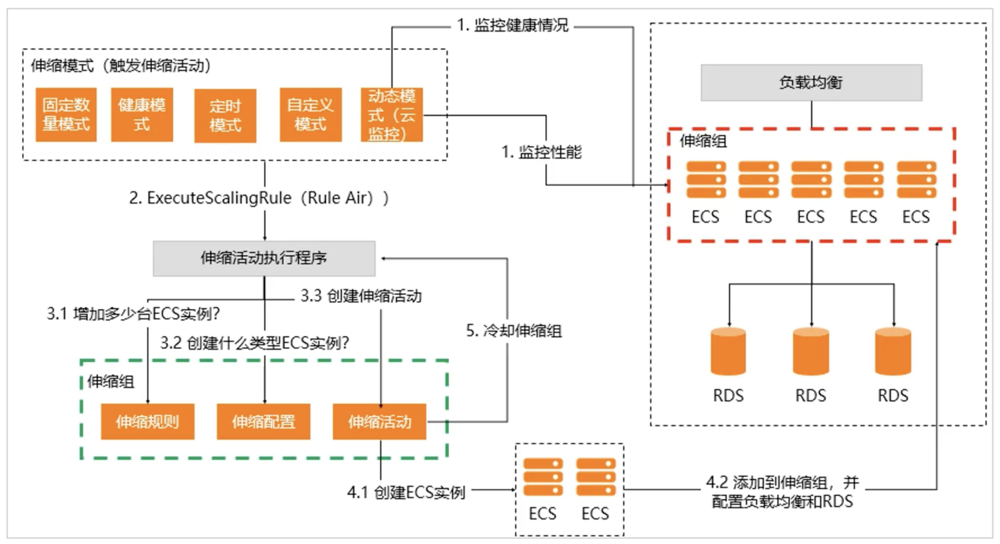

# 弹性伸缩ESS
## 概念与定位
是根据业务需求和策略自动调整计算能力（即实例数量）的服务。用户可以指定实例的类型，即ECS实例或者ECI实例。

**垂直伸缩**能够调整按量付费实例的实例规格（vCPU和内存）。
## 优势
|优势|说明|
|----|----|
|自动化|扩展时，自动创建实例，自动关联RDS实例，自动关联SLB实例。 收缩时，自动移出实例，取消关联RDS实例和SLB服务。|
|降成本|降低资源拥有的成本。|
|高可用|提供健康检测功能。自动增加相应类型的实例，替换不健康的实例。|
|灵活智能| * 支持提供计算能力的实例。 * 支持多伸缩模式兼容。 * 支持灵活的实例模版。 * 支持丰富的扩容策略。|
|易审计|弹性伸缩支持记录每个伸缩活动，提供伸缩组监控功能，有助于用户快速定位问题根源。|

## 应该场景
* 无规律的业务量波动
    * 利用弹性伸缩的警报任务。
* 有规律的业务波动
    * 利用弹性伸缩的定时任务。
* 无明显的业务波动
    * 健康检测模式，确保服务健康可用。
* 混合型的业务场景
    * 综合使用各种弹性策略保证服务可用。

## 使用限制
* 部署在伸缩组内ECS实例上的应用必须是**无状态并且可以横向扩展**。
* 伸缩组内ECS实例会自动释放，不适合保存回话记录、应用数据、日志等信息。推荐将应用数据保存到云数据库RDS，将日志存储到日志服务。
* 弹性伸缩**不支持自动将ECS实例添加到Memcache实例的访问白名单**，需手动。
* 如果某个伸缩组关联的RDS实例、ALB服务器、CLB服务器或者CLB实例的后端服务组被删除，则伸缩组自动解除与该资源的关联。
* 如果某个伸缩组内自动触发的伸缩活动连续失败超过30天，弹性伸缩系统巡检或暂停该伸缩组自动触发伸缩活动的功能，并通过短信或者邮件向用户通知。

## 组成
* 伸缩组：根据相同应用场景、相同实例类型的实例集合。地域了组内实例数的最大最小值、关联负载均衡实例、关联负载均衡实例、关联RDS实例等属性。
* 伸缩配置：ECS或ECI实例的模版。
* 伸缩规则：具体伸缩或扩容N个实例。
* 触发任务
    * 定时任务：可以在指定的时间扩容。
    * 报警任务：基于指定的监控指标动态扩缩容。
* 伸缩活动：**伸缩柜机触发后，就会产生一条伸缩活动，实现扩展或者收缩**。用于记录伸缩实力组内实例数、伸缩组边界值、期望实例数等数量的变化情况。执行伸缩规则、修改伸缩组边界、修改期望实例数等操作会触发伸缩活动。
* 冷却时间：同一伸缩组内成功完成一个伸缩活动后的一段锁定是时间。

* 组内实例配置信息来源：弹性伸缩从用户选择的组内实例配置信息来源获取实例配置信息，并使用这些配置信息创建实例。
组内实例配置信息的来源支持伸缩配置和实例启动模板。
## 原理

## 使用流程
* 创建伸缩组
* 创建伸缩配置
* 启用伸缩组
* 创建伸缩规则
* 创建自动伸缩任务
    * 定时任务
    * 报警任务：支持以下监控项，CPU使用率、内存、系统平均负载、、内外网和入流量、TCP总连接数和已经建立连接数。系统盘读和写BPS，系统盘读和写IOPS，内网网卡收包数和发包数等。GPU使用率、GPU内存空闲率和使用率。
## 伸缩组
创建伸缩组，需包含：伸缩规则、伸缩配置和伸缩活动。

* 伸缩组类型为ECS的伸缩组可以选择已有实例作为组内实例配置信息来源。
* 创建完后无再开启期望实例数功能。
* 只有ECS支持选择启动模板作为组内实例配置信息来源。
* 一个伸缩组中，可以创建多个伸缩配置，但同一时间只允许一个伸缩配置处于生效状态。
* 创建伸缩组的时候需要配置实例的边界值，如最大实例数、最小实例数、也可以配置期望实例数。
    * 创建伸缩组未配置期望实例数时，如果组内最小实例大于0，且伸缩组内默认添加的已有实例数量小于最小实例数，则弹性伸缩会自动触发一次。
    * 创建伸缩组配置了期望实例数时，如果组内期望实例数大于0，且与伸缩组内默认添加的已有实例数不一致，则弹性伸缩会自动触发一次扩容活动。
    * 如果伸缩组中当前实例数量大于组内最大实例数，则伸缩组会自动移出多余实例，使得伸缩组内的实例数量等于伸缩组最大实例数。
    * 默认触发的扩容活动与伸缩规则没有任何关系。

### 伸缩组状态
|状态|API对应的状态|
|----|----|
|创建中|Inactive|
|已创建|Inactive|
|启用中|Inactive|
|运行中|Active|
|停用中|Inactive|
|已停止|Inactive|
|删除中|Deleting|

### 删除伸缩组
* 如果不需要某个伸缩组可以删除。删除伸缩组会同时删除组内的伸缩配置和伸缩规则。如果组内存在运行中的ECS实例，弹性伸缩或线停止实例，然后移除所有手动添加的ECS实例，并释放所有自动创建的ECS实例。
* 开始伸缩组删除保护后，用户不能在控制台或者通过API删除该伸缩组。
* 定时任务和云监控报警任务独立于伸缩组存在，不依赖于伸缩组的生命周期管理，删除伸缩组不会删除定时任务和报警任务。

|类型|说明|
|----|----|
|强制删除伸缩组|会先停止伸缩组，拒绝接受伸缩活动请求，然后等待已有的伸缩活动完成，然后移出所有手动添加的ECS实例，并释放所有自动创建的ECS实例，删除伸缩组。|
|不强制删除伸缩组|满足一下两个条件时，会停止伸缩组，然后再删除伸缩组。 · 伸缩组没有任何伸缩活动。 · 伸缩组当前的ECS实例数量(Total Capacity)为0.|

### 自动创建ECS实例
特征：
* 创建的ECS实例都是相同的。
* 如果伸缩组指定了RDS实例，系统会自动将ECS的IP加入指定的RDS访问白名单中。
* 如果伸缩组里指定了负载均衡，系统会自动将ECS实例加入负载均衡后端服务器组里。

### 手动添加ECS实例
#### 手动添加ECS实例前，需要满足的条件：
* 同一个地域
* 不能已经加入到其他伸缩组。
* 必须处于运行状态
* 实例的网络可以为经典网络或专用网络，但须要满足以下限制：
    * 伸缩组为经典网络时，只能添加经典网络的ECS实例。
    * 伸缩组为专有网络时，只能添加同一专有网络下的ECS实例。
* 伸缩组必须处于启用状态。
* 伸缩组内不能存在执行中的伸缩活动。

#### 特征：
* 不收伸缩配置中定义的规格的限制，并且手动添加ECS实例时可以绕过冷却时间。
## 伸缩配置
使用伸缩配置的特性实现自动部署
* 提供了在ECS实例上自动部署应该的能力
* 伸缩配置支***持标签、密钥对、实例RAM角色**和**实例自定义数据**。
伸缩配置具有两种状态：Active & Inactive。
## 伸缩规则
用来指定每次伸缩活动的规则，如增加或减少ECS的实例的数量，或者智能设置伸缩组的最大或者最小实例数。
|规则类型|用途|说明|
|----|----|----|
|简单规则|触发伸缩活动。|支持增加或减少指定数量的实例，或者将实例数量调整至指定值。如果简单规则由报警任务触发，则需要等待冷却时间结束后，才可触发成功。|
|步进规则|触发伸缩活动。|基于云监控报警服务的分段扩缩容策略，在简单规则的基础上增加分步定义，可以通过一组策略集合精细地控制扩缩容。|
|预测规则|智能设置伸缩组边界值。|系统可以通过分析伸缩组在至少24小时内的历史监控数据，利用机器学习能力预测未来48小时的监控指标值。|
|目标追踪规则|触发伸缩活动|用户需要选择一项云监控指标，并指定目标值。当伸缩组的数据指标达到用户设定的目标时，触发此警报任务执行关联目标追踪规则。|

## 伸缩模式
|伸缩模式|配置方式|说明|
|----|----|----|
|固定数量模式|伸缩组+实例配置来源|该模式的伸缩效果由伸缩组以下配置决定：最小实例数、最大实例数、期望实例数（可选）|
|健康模式|伸缩组+实例配置来源|该模式需要开启伸缩组中实例的健康检查配置项。|
|定时模式|伸缩组+实例配置来源+伸缩规则+定时任务|该模式的伸缩效果由定时任务决定。多个定时任务时先执行最早触发任务。|
|动态模式|伸缩组+实例配置来源+伸缩规则+报警任务|该模式的伸缩效果由报警任务决定。|
|自定义模式|任意伸缩模式的配置方式|该模式下，用户可以手动添加、移出或者删除已有的ECS实例。如果配置了伸缩规则，用户还可以手动执行伸缩规则。（手动创建，需手动管理）|
|多模式并行|组合各伸缩模式的配置方式|根据选用的伸缩模式不同，生效的配置项也不同。|
## 伸缩活动
执行伸缩规则、手动添加或者移出已有ECS实例时，均会触发伸缩活动实例扩张或者收缩。触发伸缩活动后，所有扩张和收缩动作都由系统自动完成。
### 伸缩活动的特点
* 无法强制终止
* 保持ECS实例级事务完整性
* 有冷却时间
* 可进行实例生命周期托管
* 可进行实例释放保护
* 同一个伸缩组内，同一时刻只能有一个伸缩活动执行。
* 报警任务和定时任务触发的伸缩活动没有优先级区分。
### 自动创建ECS实例时伸缩活动流程
* 判断伸缩组

## 应该场景
在伸缩活动成功、失败或者被拒绝时，弹性伸缩支持通过以下方式发送通知：
* 消息通知
* 事件通知：支持发送消息到云监控。
    * MNS主题
    * MNS队列

如果伸缩组类型为ECS实例，指定有ECS实例提供计算能力时，还支持以下功能：
* 生命周期挂钩
* 自定义方式
* 滚动升级
